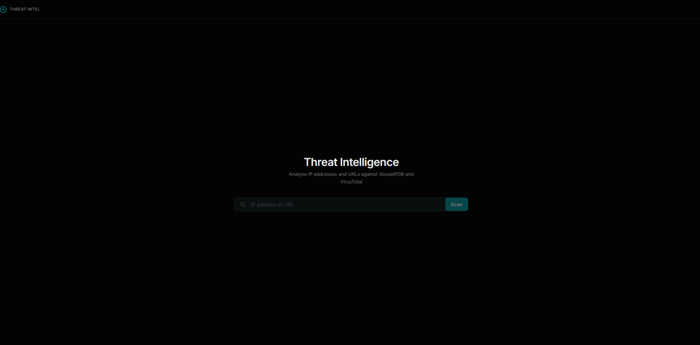
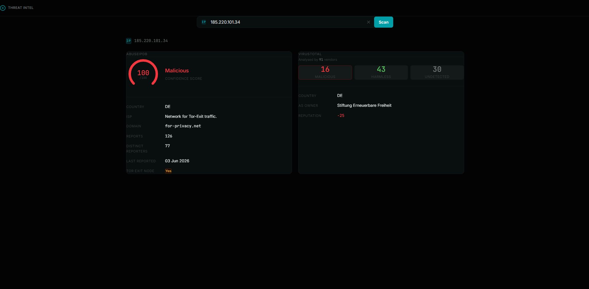
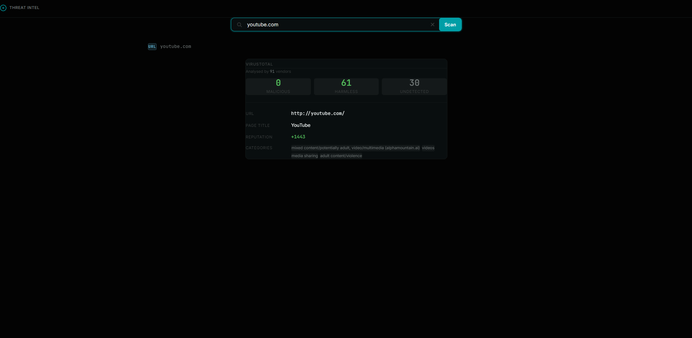

# URL Threat Intel

A single-page threat intelligence tool. Enter an IP address or URL and it queries AbuseIPDB and VirusTotal in parallel, returning a structured threat assessment: risk score, vendor consensus, geolocation, and supporting metadata.

Built to learn FastAPI and practice working with external APIs, including parallel requests, rate limiting with slowapi, and error handling across multiple third-party services.





## Stack

- **Frontend:** React, TypeScript, Vite, Tailwind CSS, Claude Code
- **Backend:** Python, FastAPI, httpx
- **Infrastructure:** Docker, Nginx, docker compose

## Run locally

**Prerequisites:** Docker and docker compose installed, API keys for AbuseIPDB and VirusTotal (both free tiers are sufficient).

1. Clone the repo

```
git clone https://github.com/thomas-stk/url-threat-intel.git
cd url-threat-intel
```

2. Add your API keys

Create a `.env` file in the root:

```
ABUSEIPDB_API_KEY=your_key_here
VIRUSTOTAL_API_KEY=your_key_here
```

3. Start everything

```
docker compose up --build
```

The app will be available at `http://localhost:5173`.

## API keys

Both APIs have a free tier with no credit card required.

| Service | Free tier | Sign up |
|---|---|---|
| AbuseIPDB | 1,000 checks/day | https://www.abuseipdb.com/register |
| VirusTotal | 500 lookups/day | https://www.virustotal.com/gui/join-us |

## Project structure

```
url-threat-intel/
├── main.py                    # FastAPI entry point
├── routers/                   # Route handlers
├── services/                  # AbuseIPDB and VirusTotal clients
├── Dockerfile                 # Backend container
├── docker-compose.yml         # Wires frontend and backend together
└── frontend/
    ├── src/
    │   ├── components/        # React components
    │   ├── services/          # API client
    │   └── types/             # TypeScript types
    ├── Dockerfile             # Multi-stage: Vite build then Nginx serve
    └── nginx.conf             # Serves SPA, proxies API calls to backend
```
